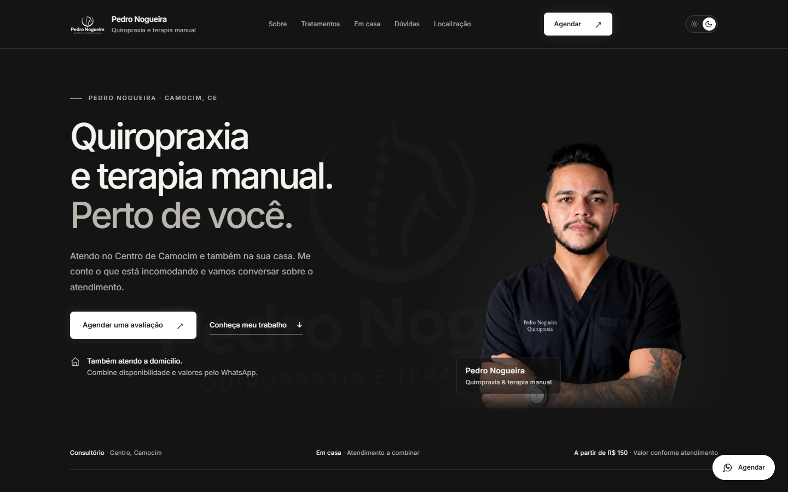
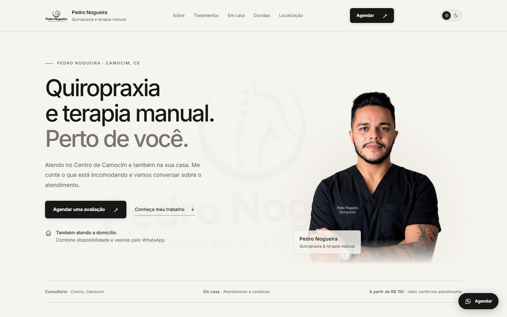

# Pedro Nogueira · Quiropraxia e Terapia Manual

Site de página única para o Pedro Nogueira, que atende com quiropraxia e terapia manual em Camocim (CE), no consultório e a domicílio. O agendamento é feito pelo WhatsApp.

| Desktop (escuro) | Desktop (claro) |
| --- | --- |
|  |  |

| Mobile (escuro) | Mobile (claro) |
| --- | --- |
|  |  |

## Tecnologias

HTML, CSS e JavaScript puros, tudo no `index.html`. Sem framework e sem build.

## Funcionalidades

- Tema claro e escuro: segue o sistema, lembra a escolha e é aplicado antes da página aparecer (sem piscar)
- Botões de WhatsApp com mensagem pronta, para consultório ou atendimento em casa
- Mapa do consultório (Google Maps) e perguntas frequentes
- Imagens em WebP com `srcset`
- Link para pular ao conteúdo, foco visível e suporte a `prefers-reduced-motion`
- Open Graph, favicon e dados estruturados (JSON-LD)

## Rodando

Abra o `index.html` no navegador, ou sirva a pasta:

```bash
npx serve .
```

Para publicar, basta enviar o `index.html` e a pasta `assets/` para qualquer hospedagem estática. Depois, troque o `og:image` por uma URL absoluta e adicione `og:url` e `canonical` (tem um comentário no `<head>` indicando onde).

## Autor

Anderson Ferreira
